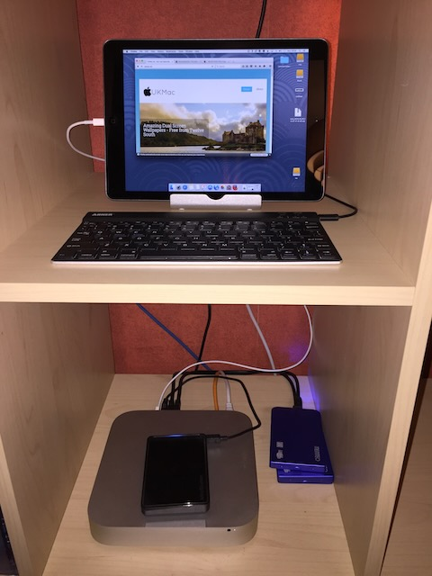

[Duet Display](https://geo.itunes.apple.com/gb/app/duet-display/id935754064?mt=8&at=1000lbQg) is a slick app developed by ex-Apple employees designed to allow your iPad to function as a second monitor on your laptop or iMac using a lightning or iPad 30 pin cable ( for older iPads ). The application works extremely well with none of the lag or latency in display refresh experienced by some of the alternative apps that use the iPads WiFi connection to transfer screen updates.

As the Duet name suggests the intended use for the app is to create an easy to use portable secondary display for MacBook users ( or in fact Windows laptop users as there is a Windows version of the server application as well as one for OS X ) but it isn't limited to this use case. My main use of Duet is as a primary monitor on my Mac Mini media server.

I have used my Mac Mini in a headless ( no monitor ) setup for a long time and use Screen Sharing from my MacBook to login and manage it, however it recently struck me that the 
[Duet Display app](https://geo.itunes.apple.com/gb/app/duet-display/id935754064?mt=8&at=1000lbQg)that I had purchased some time ago would be perfect for creating a tiny compact keyboard/monitor setup. Combined with a small bluetooth keyboard from Anker and bluetooth mouse I now have full access to my Mini in a compact little setup that looks pretty slick on the shelf in my study.

Duet Display is £7.99 in the UK iOS App store which I admit is probably at the high side of many peoples acceptable budget for an app of this type, however this app is extremely good and provides amazing functionally and performance. For people who travel with a MacBook and iPad the benefit of being able to setup a usable dual monitor setup whilst on the move can be liberating, and for home media servers like mine it can create a slick, compact and usable alternative to a bulky VGA/HDMI monitor.

