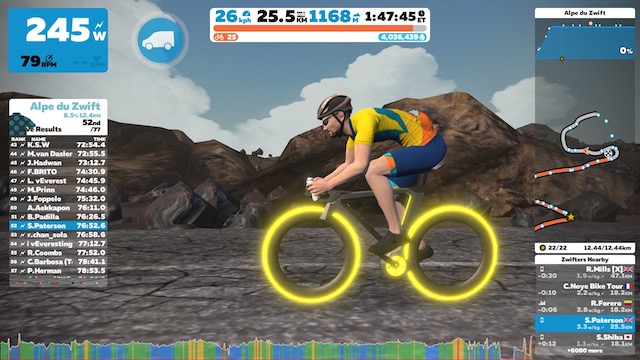

Yesterday was a big day on [Zwift](https://zwift.com) for me. Finally after about 18 months of rides I passed the 50,000m climbing needed to be awarded the [Zwift Concept Z1](https://zwiftinsider.com/tron-bike/) better known by Zwifters as the Tron Bike !

Prior to my ride yesterday I had around 800m of climb left to do so decided what better way to knock off those last metres than to do it on [Alpe du Zwift](https://zwiftinsider.com/massive-alpe-du-zwift-climb-released/). I was about 3/4 of the way up when the notification popped onto the screen to say I had been awarded the Tron bike. As you can see from the picture I took the opportunity when I got to the top to quickly change over to my new steed for the ride down again (with suitably large smile on my face!)

Happy cyclist :)
