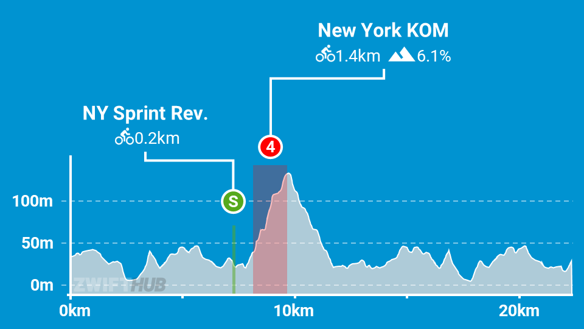

One more Zwift route complete tonight, this time the [New York route Knickerbocker](https://zwiftinsider.com/nyc)

At just over 22km its not a hard ride but it does include the fairly painful New York KOM that tops out at 17% right in the middle of it, so there is that ! Fairly sure I have ridden this route multiple times before as well though seemingly not to the end as I hadn't got the achievement in the trophy cabinet but now I do.
