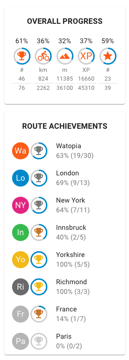
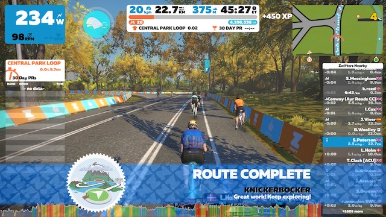

Over the last few weeks I have been working my way through the Zwift Achievements and so far have managed to complete 61% of the routes ( 46 out of 76 ), obviously not all in the last few weeks....

Until recently I hadn't seen an easy way of tracking progress on Zwift without actually sitting on my bike, launching Zwift, starting a ride and then navigating to the achievements section. The Zwift companion app does a fairly poor job of showing you historical activity other than the chronological list of activities completed. Then I came across [this video from GPLama](https://youtu.be/KgSfajJzW6M) in which he explains how to use a third party web site called [Zwifthub](https://zwifthub.com) to keep track of all your Zwift badges and achievements. You can setup a Zwifthub account or login with a Google account (unfortunately there is no direct link to your Zwift account) and manually update your profile with all your achievements to date. After that you can use the simple filters in the web site sidebar to show you which routes you have completed, which are still to be done, which are available to ride today and then further sort the lists by distance, elevation, gradient etc.

The site is simple in focus but very well executed and fills the gap left by Zwift extremely well. I would imagine that many other Zwifters would find this service useful or at least interesting, even if they are not aiming to complete all the routes and badges on Zwift.

