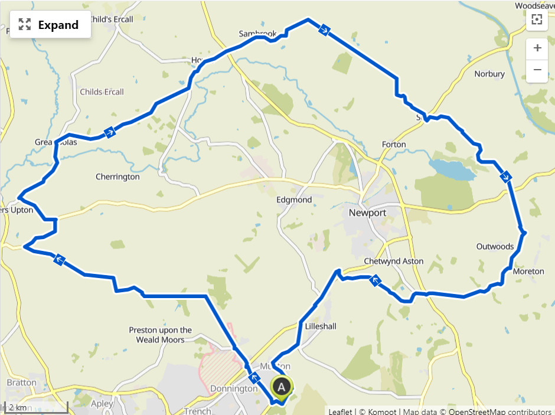

Today I took a break from Zwift and headed out early to do a ride round the lanes near to home. I had planned a 50 loop on Komoot parts of which we familiar to me but a few bits that were new. The new bits turned out to include a couple of short off road sections, the first of which was easy enough, but the second not so much. After taking a left onto a farm track at Howle and riding about 1km up a steady hill the track just disappeared into a mass of hedgerow, nettles and brambles. Despite my best efforts and the fact that I could hear the road that I was trying to get to behind the fields to my right, I couldn't find a way through and ended up re-tracing my steps down the track and back onto the main road. I suppose this is part of the risk with planning a route on Komoot, the paths may not always be what you expect, but it does make for an interesting morning.

