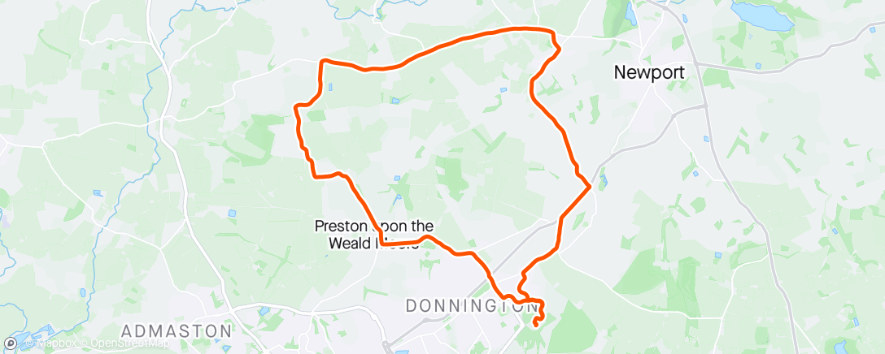

A belated Happy Christmas greeting to anyone unfortunate enough to be reading this blog, hope yours went as well as could be given the world in which we find ourselves. For my part Christmas was quiet and fairly relaxed and as usual over quicker than you can imagine. The actual day this year did feel quite "christmassy" due to the morning frost and clear blue sky which was really nice. Today on the first Boxing Day of 2020 (the second official one is on Monday) was slightly less so although it did manage to stay dry here in Telford until after dark. Tonight we are in for a bit of a storm as Storm Bella makes her way across the country.

I did manage to get out on my bike this afternoon for a [quick 25k](https://www.strava.com/activities/4520655463/embed/b8a01a92293e813e84ef5915c4bbb24aab9c3616) before dark which was nice especially as the roads were really quiet (almost like being back in the first lockdown again). My route tonight didnt take wind direction into account though so after an quick assisted outbound ride the return was a little slower as I battled into the early part of Storm Bella.

