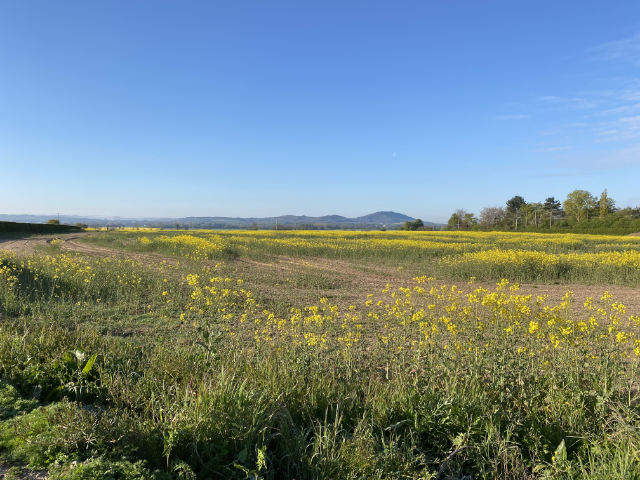

Living in England you learn to take advantage of the good weather when it presents itself. Today is Bank Holiday Monday and as usual it's pouring with rain. Yesterday however was perfect for an early morning bike ride so I made hay and got out first thing for a quick 50k around the [Weald Moors](https://en.wikipedia.org/wiki/Weald_Moors).

It was a very cold start but I soon warmed up and was enjoying the clear air, lack of cars on the roads and the beautiful Shropshire countryside. Not a bad start to the day.
