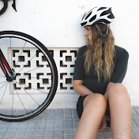
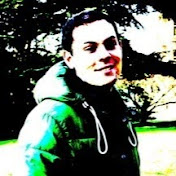
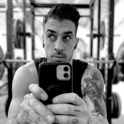
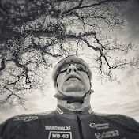
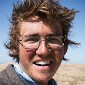
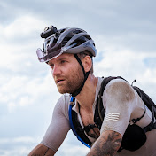
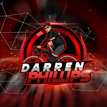

## [Katie Kookaburra](https://www.youtube.com/c/KatieKookaburra)
|| Katie is a long distance specialist who loves to climb hills. She posts regularly and has a large following of over 100k subscribers. One of my favourite channels and one that I look forward to new episodes of.|
|----|----|

## [Adam Watkins](https://www.youtube.com/user/adumwatkins)
||Adam is not the most regular YouTuber but he is definitely my favourite. A seasoned Audaxer who covers huge distances a lot of which he does on a fixie ! He has a great sense of humour ( at least I think so ) and a unique style.. Watch out for gout !|
|----|----|

## [Dave Noakes](https://www.youtube.com/c/DaveNoakes)
|| Dave's channel is a mixture of gravel rides, BMX with his daughter, new bike builds and a variety of races and events. I have to admit when I first watched Dave's channel I was a bit put off by his quirky style, but stick with him, he is developing his style and is actually quite refreshing |
|----|----|

## [Juliet Elliott](https://www.youtube.com/c/JulietElliottsChannel)
|| Juliet is the ex-partner of Dave Noakes and is another 100k+ subscriber channel that goes back over 12 years. Juliet is a bubbly presenter who was a pro-snow boarder, BMXer and cycle courier amongst many other things I'm sure. The channel is a mix of gravel riding, backpacking and competitive crit rides. |
|----|----|

## [Leonard Lee](https://www.youtube.com/user/leonardmlee)
| | Leonards channel is a little different to the typical cycling YouTube channel. Leonard is a 50+ year old who is "gravitationally challenged (quote)" and his channel is aimed more at the new cyclist or the returning cyclist who is perhaps not ready for 200km Audax's just yet. |
|----|----|

## [Ed Pratt](https://www.youtube.com/c/MrEdPratt)
| | Ed's channel is as fascinating as it is quirky. From March 2015 to July 2018 Ed pedalled a unicycle 22,000miles around the world. Over that time he crossed 4 continents and performed over 12 million pedal rotations... Since then he has moved onto long distance tandem adventures with his partner Aishola. |
|----|----|

## [Fernwee](https://www.youtube.com/c/Fernwee)
| | Fernwee is a dutch rider who covers his adventures on gravel and road alone and with his group of friends. High production value channel with some really good content |
|----|----|

## [Darren Phillips aka Mendip Cycling Vlog](https://www.youtube.com/c/MendipCyclingVlogs)
| | Another high production value channel from Darren that was previously known as the Mendip Cycling Vlogs. Lots of rides around the Mendips but also covers other parts of the world too. |
|----|----|
 