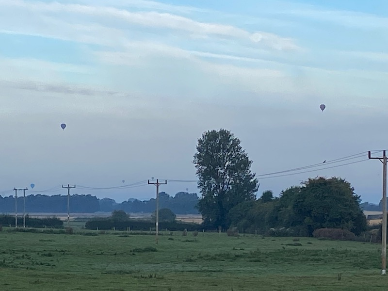
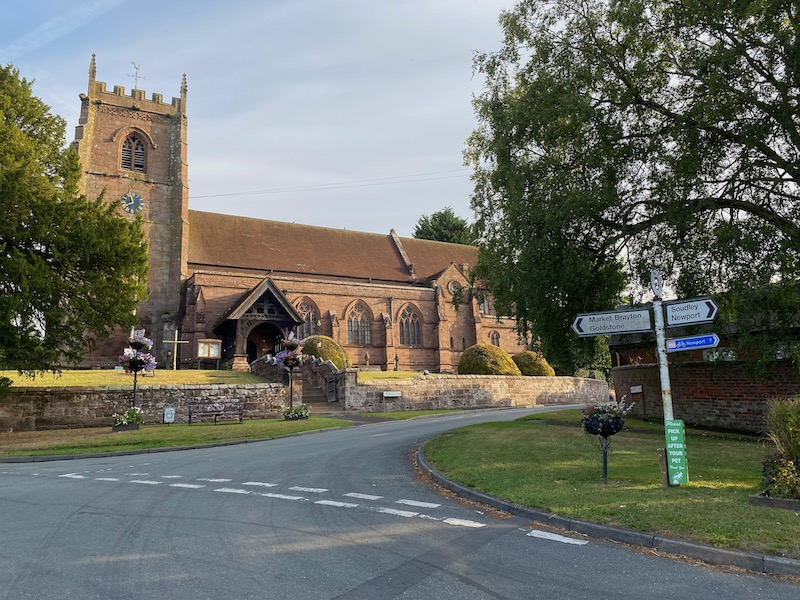
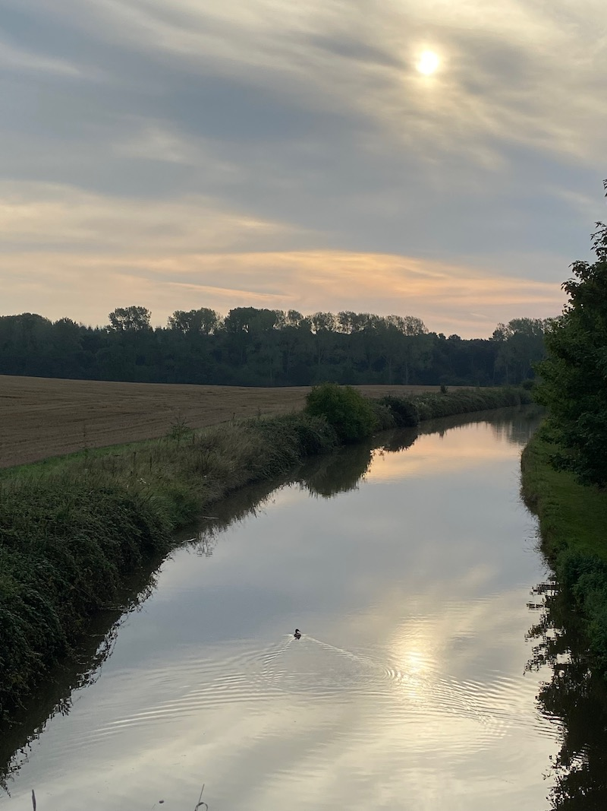
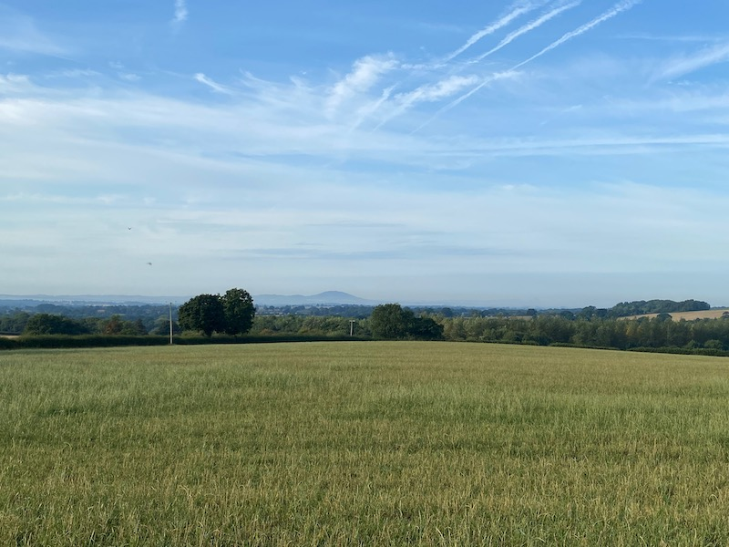
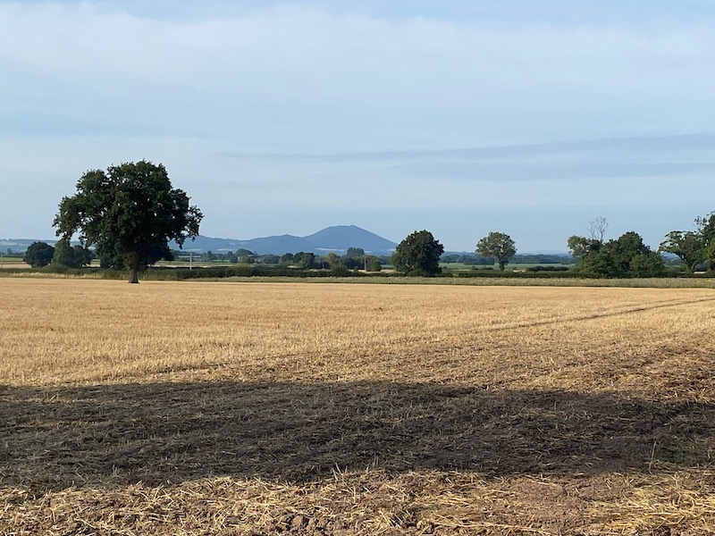

## Muxton to Cheswardine

Starting an early ride in late August in the UK can be tricky when making decisions about clothing, too much and by the time you get going you are cooking and too little and the early part of your ride can be on the chilly side. This morning I went for a thin base layer, short sleeve jersey and shorts which turned out to be a wise choice. It was pretty cool at 7am as I headed towards Edgmond, the balloons from the [Telford Balloon Festival](https://www.bbc.co.uk/news/uk-england-shropshire-62689463) hanging across the misty fields to my left

My planned route was a [50K loop to Cheswardine](https://www.komoot.com/tour/905565828) returning via Stoke on Tern and Childs Ercall. I have done this route a couple of times and it is a pleasant ride with very little traffic. In fact today during the entire ride I was only past ( from behind ) by 5 cars, three of which were in the final 3k of the ride as I got close to home.

The route is pretty flat with the only real uphill section taking you from the Chester Road after St Michaels Church, Chetwynd along [Sustrans route 552](https://travelshropshire.co.uk/cycle/cycle-routes/national-cycle-network/regional-cycle-route-75.aspx) up to the Church at Cheswardine.

Bridge over the Shropshire Union Canal

Once I had passed Cheswardine the sun started to rise high enough to warm the morning and as I headed towards Stoke on Tern the Wrekin was visible in the distance.

Most of my routes around the local villages are rarely out of sight of the Wrekin

## Daily Links

|Link|Description|
|--------|----|
|[Komoot Route]([url](https://www.komoot.com/tour/905565828))| Muxton to Cheswardine 50K Loop |
|[Strava](https://www.strava.com/activities/7712624209)| Strava Recording |