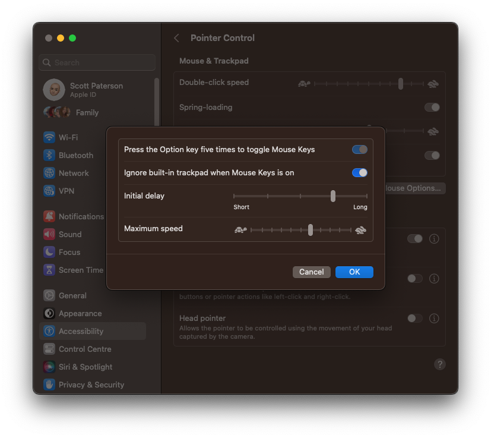

Following my desk space re-organisation this weekend I am back to using my MacBook keyboard again for the first time in quite a while. Having worked predominantly with an external mouse and keyboard with my MacBook in clamshell mode in a vertical stand I decided I would like to disable the MacBook trackpad.

Simple you would think? Apple do kindly offer a setting in the Mouse & Trackpad Accessibility preferences to do this very thing, however  after switching on the option I found my trackpad was still fully operation even with my Logitech MX Master connected. It appears that Bluetooth mice don't register as a mouse being present?

The fix I discovered was to use another Accessibility preference known as Mouse Keys, a legacy service designed to allow cursor control using the keyboard.

Firstly enable Mouse Keys by switching on the slider in the Pointer Control options, then click on the i next to the slider to reveal the additional preferences dialog below.

Switch on the two sliders to disable the trackpad when Mouse Keys is on and also enable the option to quickly enable/disable Mouse Keys by pressing the Option key 5 times. You should find that the trackpad is now correctly disabled. To enable the trackpad again just turn off Mouse Keys by tapping Option key 5 times.

Job done.
