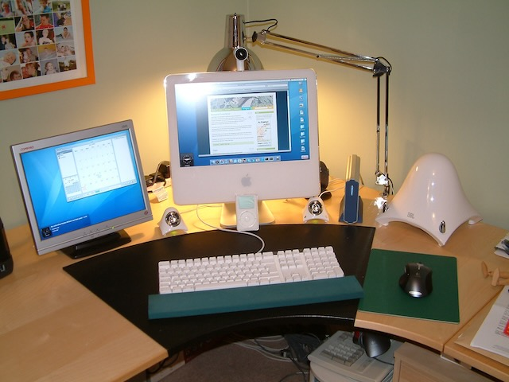
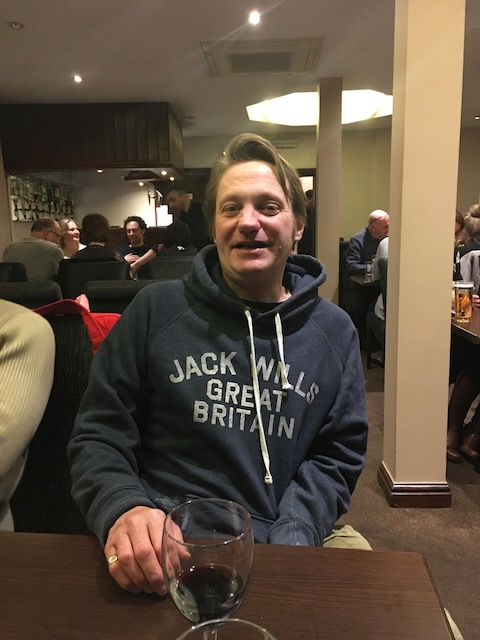

A couple of weeks ago I got a text out of the blue from an old friend, James who had just heard that another friend of ours, Will Green, had unfortunately passed away. 

I hadn't heard from Will or spoken to him in some time but the out of the blue call from James did leave me winded. James and I spoke for quite a while, reminiscing about things and I think both of us could not quite believe it. Our friendship came about through our love of Apple Mac computers and a strange coincidence of geography. 

My interest in Macs started when I bought an 17" G5 iMac in 2005. At the time my work life was entirely Windows centric and I think I recall deciding to buy a Mac mostly out of curiosity. I was of course quickly sold by the elegance, slick design and polished software. 

I think soon after I bought into the Mac lifestyle I registered this domain (ukmac.net) and started with my early blog focused on Apple and my new Mac. As a keen Apple fan I of course started consuming what I could from the Internet from various web sites/blogs and also from a number of podcasts such as Macbreak Weekly and the wildly eccentric BritishMac podcast.

BritishMac was a regular chart topper in the podcast Tech charts in those days and by a bizarre twist of fate was run by Will who happened to live only a few miles from me in Ironbridge, Shropshire. Through another weird coincidence I came into contact with James who had also recently started a Mac focused blog at Ukmac.co.uk, even more coincidently James lived in Broseley a few miles away from Ironbridge in the opposite direction from myself. It was meant to be I guess.

Suffice to say James, Will and myself ended up meeting in Ironbridge for a few beers and to talk about our favourite subject, Macs. 

Will was one of life's characters. If you ever heard any of his podcast episodes you will know what I mean. His blog and podcast were unique and eccentric, there really weren't any like it at the time (nor since that I have seen at least). In addition to his irregular podcast postings Will used to host a Christmas get together in Ironbridge and would invite any of his listeners who wished to meet up for drinks and a curry at his local Indian restaurant, the Aftab. 

On a couple of these meet-ups Will got us together at a little studio he had at the time to record a podcast episode before we headed to town for food. The resulting recordings were somewhat less than polished but that wasn't the point and didn't stop everyone enjoying being part of the process.

Will's funeral was this Tuesday in Shrewsbury and I was fully intending to go to show my respects and also to meet-up with some of the group that used to go to Will's Christmas events but in a cruel twist I have been laid up in bed all week with a viral illness and was not able to make it.

