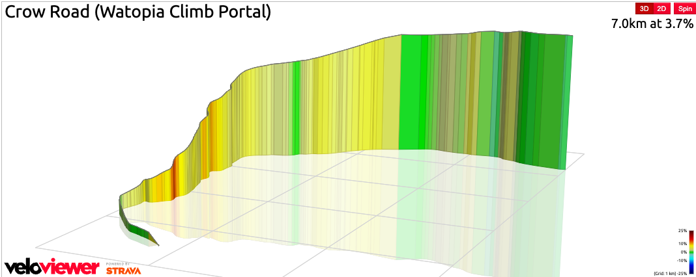

## Crow Road

Today was my first proper ride for over a couple of weeks and also my first go on the new [Zwift Portal(https://zwiftinsider.com/climb-portal-list/)] routes. I was prompted to try [Crow Rd](https://zwiftinsider.com/portal/crow-road/) on the Zwift rides home screen so I decided I would give it a go. At 6.9km this is not a particularly long climb but after not riding for a while and with legs that still felt a little on the weak side it may have turned out to be a bad idea.

The route is 251m of elevation and the steppest parts of the route are thankfully in the first km so you can get those bits over early and then settle into a slightly easier average gradient for the next 4-5km.

Thankfully my lungs and legs held out and I made it to the top in what felt like a fairly respectable time of just under 26 mins. Now I have the first one under my belt I think I will aim to try and complete the other routes over the next few weeks.
