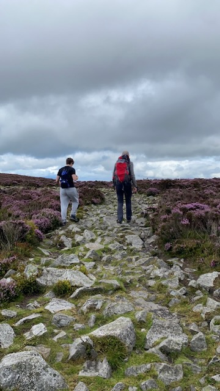
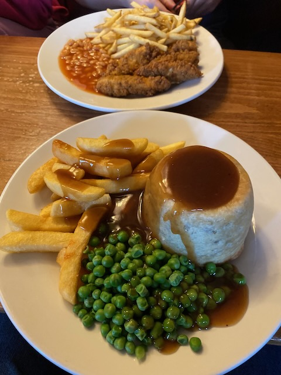

## Preparations

Camping in the rain can be a little disappointing but its something British campers tend to get used to. This trip was to be the first for my daughters who had never been on a family camping trip before despite both being in their late teens. They had camped with school but wanted to have an family camping experience so we had planned a one night trial run to see how they got on. I had been watching the weather reports in the run up to the day and was expecting light rain in the morning so it wasn't unexpected when I woke to a grey and damp morning.

By about 9am the girls were up and we started to get our things together for the trip to the [Shropshire Hills](https://www.shropshirehillsaonb.co.uk). 

## Cancelled

The drive to our campsite was only about 30 miles but the last few mile were down narrow lanes and the last mile along a rough and steep farm track. We got to the farm yard and there didn’t seem to be anyone around so I called the number of the farm. The guy I had spoken to yesterday answered and said he was sorry but there was no way we could drive to the pitches as the overnight rain had left the access road too slippery to drive, he said he couldn’t get up it in his Land Rover Discovery. He said he had text me earlier in the morning to say we shouldn’t come but I hadn’t seen the message. 

## The Hollies Farm

To say we were disappointed would have been an understatement. Our options were to abandon completely or try and find an alternative camp site. A couple of miles before the turn to lower Vellons farm we had seen a sign for a “glamping” site so we decided to head there and see if we could get a pitch for the night. When we arrived it was a flat field with a bunch of clamping pods on a very nicely laid out plot but no sign of tents so I wasn’t hopeful of getting a pitch. Sure enough the lady at the office said they weren’t allowed tents due to their planning permission for the site but she very helpfully rang another site, [The Hollies](https://www.pitchup.com/campsites/England/Central/Shropshire/pontesbury/hollies-farm), for me who told her they would take a tent. She gave me directions and told me to pitch up in the field and the owner would come and see us later. We would know we had the right place as there was one other tent there already. 

## Getting setup

A short drive later and we were on a small field overlooking a fabulous view of the Shropshire hills. The rain was still drizzling and there was quite a breeze blowing so I anticipated a struggle to get the tent up as we had only tried it twice before. The first time was also windy and Ria and I gave up as we couldn’t manage to get the hooped poles in place whilst stopping the wind from trying to blow us away. The second time we managed to get it up ok after a bit of a struggle pushing the poles into place. This time there were three of us and we needed to get the tent up quickly to get out of the rain. 

Amazingly we had the poles in and the outer pegged down in just a few minutes and with barely a crossed word. Teamwork it seems worked for us.

Once we had the outer up we got the bedroom inners in place in a few more minutes and within a short space of time we were setup with camp chairs and the little stove boiling some water for tea and lunch. Perfect. 

## Walking the Stiperstones

Once we had eaten we set off for a walk up to the [Stiperstones](https://en.wikipedia.org/wiki/Stiperstones). A short walk up the lane took us through a farm yard which led to the gate to the Shropshire Way. We took a left aiming to walk to the West end of the ridge that leads up to the Devils Chair before descending back down to the Hollies Farm for the return. 

The first part of the route was through a small wood with a brook running down the right of the path. Once we emerged out of the woods we were on a bracken and heather lined path which after a short walk turned right back on ourselves and headed up to where we could see the Devils Chair shrouded by low clouds. The wind was blowing pretty hard at this point and we were all getting pretty wet, but then as we reached the [Shropshire Way](https://shropshireway.org.uk) the cloud cleared and we quickly dried out courtesy of the continuing strong winds.

The ridge across the top of the [Stiperstones](https://en.wikipedia.org/wiki/Stiperstones) is strewn with irregular and jagged stones which makes progress pretty slow and quite treacherous, a twisted ankle would be pretty easy to acquire and would make the return leg of the walk very uncomfortable. 

## Descent

Despite the conditions the walk along the summit was enjoyable and the views by this time were spectacular, the panorama surrounding us reaching into Wales and across the Shropshire peaks. Soon we were at the point where we could turn back down the hill side towards the campsite and before long we were out of the wind and back onto much smoother terrain, crossing the fields in front of the Hollies Farm, complete with a herd of cows who mercifully seemed uninterested in us, before joining the short lane to our tent.

## Stiperstones Inn

After resting at the tent for an hour or so we changed and headed in the car to the [Stiperstones Inn](https://www.stiperstonesinn.co.uk/) for our evening meal. The Inn is a proper traditional English country pub with a menu that included steak and kidney suet pudding and apple crumble and custard for dessert... Superb stuff.

Once we had availed ourselves of the Inn WiFi and eaten our fill it was time to head back to the tent for a well earned night under canvas. 

The evening air had already started to cool when we got out of the car and the girls commented on it being cold, but once we were in our campbeds and snuggled down the complaints soon stopped. I was certainly glad to be in bed and despite a slow puncture on my airbed that gradually deflated through the night leaving me on the floor in the morning I slept pretty soundly and the girls were quiet until 7am the next morning when we woke to a spectacular sunny morning...

TBC