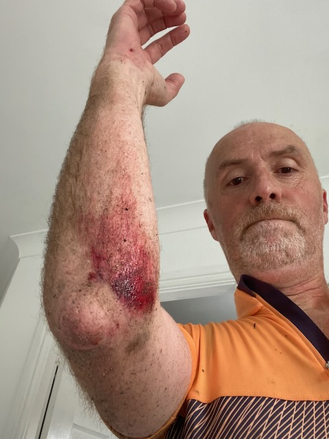

## A wet ride

I should have gone with my gut this afternoon when I was planning a short ride. Just before I set off the clouds opened and it poured down. I had just checked on my weather app and it did say no rain so I decided it was just a short downpour and I should go for it.

The first 10 minutes were ok but by the time I reached [Kynnersley](https://en.wikipedia.org/wiki/Kynnersley) it was raining again and slowly got heavier. I ploughed on as I hadn't been out on the roads for a while and wanted to do at least 30k. By the time I reached the turn for Ollerton/Childs Ercall I was well and truly soaked and so decided to take the corner off the ride and not go to Ollerton and to head straight to [Childs Ercall(https://en.wikipedia.org/wiki/Child%27s_Ercall)] instead. This turned out to be the wrong choice. As I took the right hand turn to Childs Ercall I felt the back wheel go and before I knew where I was I was on my side on the edge of the road ! Not what I had planned.

Fortunately I was largely unhurt apart from my right arm having a nice bit of road rash. Thankfully it is a quiet country lane and there were no cars around.

After straightening my handlebars and brushing myself down I continued on with the rest of the wet ride home. This was my first spill on a bike for many years but it didn't make it feel any less embarrassing that I had fallen off.

I suspect tonight I will feel the impact of this fall as the bruising comes through but at least I am in one piece and ready to ride again, albeit I will probably take it a little more gingerley on the corners when the roads are wet next time.

    
    <!-- html codes here-->  
    



