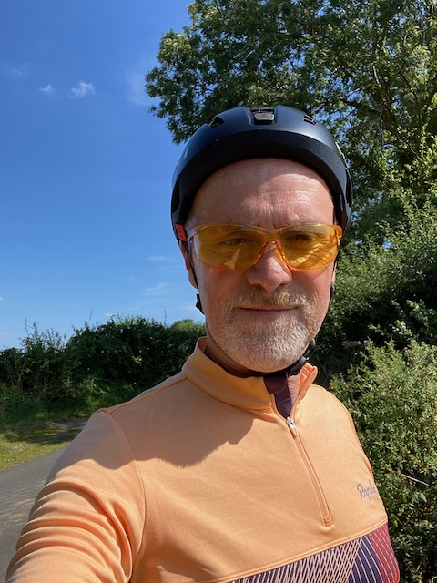
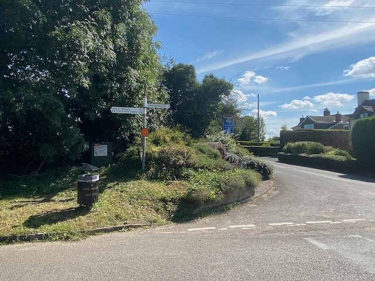
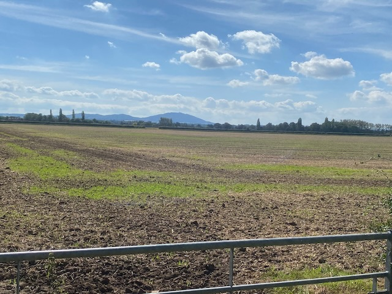

[Last weeks ride](https://ukmac.net/p/a-lesson-in-how-not-to-ride-in-the-rain/) couldn't have been more different from todays. I wasn't sure I would get time to go out this afternoon but when the opportunity of a quick hour circuit raised its head I didn't wait for it to pass by.

I know I am really lucky to be near enough to quiet country lanes that I dont need to plan ahead to get my bike in the car and drive to a starting point and the [North Shropshire](https://en.wikipedia.org/wiki/North_Shropshire_(UK_Parliament_constituency)) countryside has some really enjoyable cycling. 

My route today was only 40K but this was enough enough to blow the cobwebs away and get me ready for a week at the home office. 

    
    <!-- html codes here-->  
    



## Gallery

   
