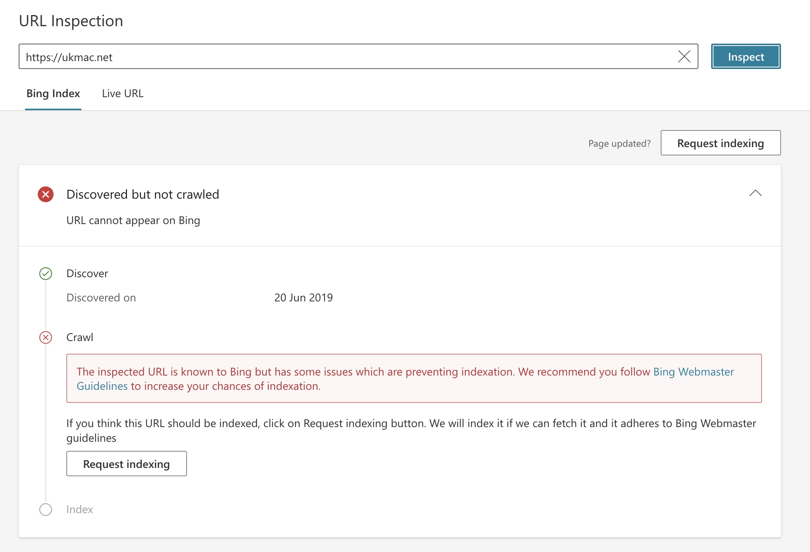

Over my years working in IT I have enjoyed dabbling with building web sites, starting way back in the early days with Dreamweaver through the early days of Wordpress, Drupal and a few other CMS's and more recently with static site generators such as Jekyll and finally Hugo which this site is currently using (in September 2023).

During this time I have always managed to get my sites indexed with Google so the random posts I created could be found, if only by me, but my latest iteration of ukmac.net seems to be unwanted by Google and more particularly with Bing. Google has a few odd pages indexed at the moment out of the approx 200 pages in this site but Bing stubbornly refuses to index any of the site and so as far as searches on Bing is concerned ukmac.net may as well not exist.

This is something I have been trying to fix for the last few weeks without any real progress and the more I dig the more I find other web site owners, some with much more popular sites than mine, who are also experiencing the same issues. What I can't tell is why Bing seems to dislike my site. Microsoft have a [set of guidelines](https://www.bing.com/webmasters/help/webmaster-guidelines-30fba23a) which supposedly tell site owners how to fix issues getting their sites indexed but they really don't help much. 

Any site owners experiencing this issue will be very familiar with the screen shot above which is the error received in the Bing Webmaster Tools site when you run a URL Inspection against your site.

The odd and very frustrating thing with this is that if you select the Live URL view at the top of the URL Inspection screen you will likely see something like this...

The issue is the "quality checks" that it refers to that I assume my site is failing are not detailed anywhere. How do you know what needs fixing ? Read the webmasters guidelines apparently but this doesnt help to show which ones your site is failing on.

Last night I found a forum post which suggested emailing Bing webmaster tech support on bwtsupport@microsoft.com for advice. I wasn't convinced I would get a reply but thought there was nothing lost in trying this. Amazingly I got a reply within an hour with a case number and even more amazingly within another 9 hours I had a reply from a real person. The response explained that the case had been investigated and my site had been manually checked and that I had been found to be in violation of the Bing Webmaster Guidelines and as such my site would not be indexed and I was referred to check out the guidelines for help in resolving the issue. Great. IF they would tell me what the issue was ?

At this point I am sort of losing the will to carry on with this. I'm sure there are people out there who can assist with this and perhaps most of them would suggest my site is not worth Bing indexing it, and they may be right, but my techie self is still annoyed and frustrated at being beaten by this.

To be honest, I think I will continue to dabble with this site despite the lack of traffic due to being in a black hole. The site itself I think looks better than it has done before and site building with Hugo is teaching me a lot about Git, Visual Studio Code and Markdown which is something.

In the meantime if any web gurus do happen across my site and can shed any light or offer any advice on how to get indexed by Bing I would be very grateful to hear from you.

## Useful Links

|Link|Description|
|--------|----|
|[Bing Webmaster Guidelines](https://www.bing.com/webmasters/help/webmaster-guidelines-30fba23a)| Bing advice on how to get your site indexed. |
|[Bing Webmaster Tools](https://www.bing.com/webmasters)| Tools to analyse your site and submit it to Bing for indexing |
|[Not awesome Bing bans and de-indexing](https://github.com/nafnlj/not-awesome-bing-bans-and-deindexing)| A thorough set of resources and articles about Bing bans and de-indexing |
